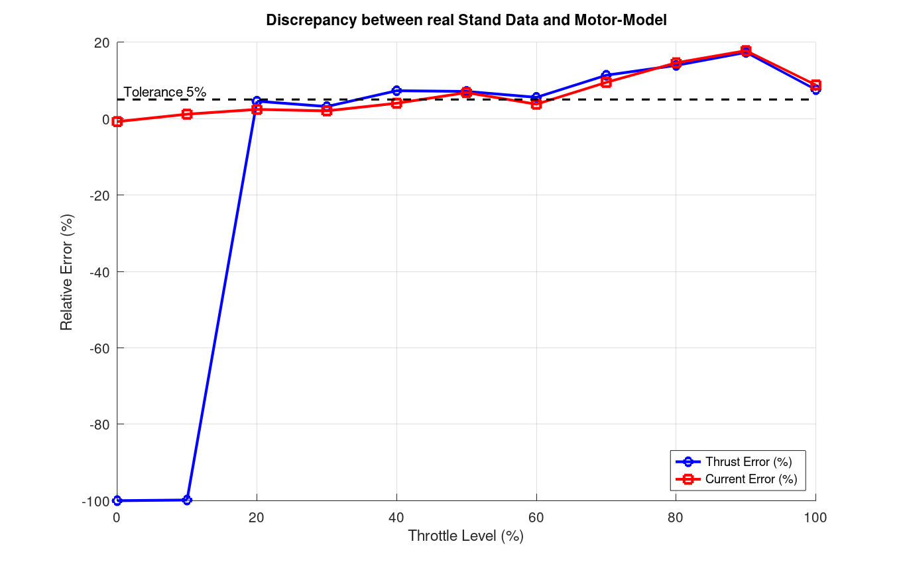

# BrotherHobby 1404 KV4600 — Semi-Empirical Motor Model for SIL Simulation

## About This Project (In Progress)

**Methodology:**
- This project is built upon the [light-mbse-pipeline-skeleton](https://github.com/meugenom/light-mbse-pipeline-skeleton) to ensure full requirements traceability and automated validation.
- A data-driven C++ motor model for drone flight simulation, built from publicly available stand test data.
- The model is **semi-empirical**: it combines the physical thrust law with gray-box polynomials.

**Setup:**
- Datasheets BLDC Motor `BrotherHobby 1404 KV4600` + `iFlight Nazgul T4030` propeller on `2S` LiPo (7.4V).

## Iteration Roadmap

| Version | Status | Requires | Reference |
|---|---|---|---|
| v1.3.0 STATIC | current | Octave->C++(LUT)->Tests->Report | [Datasheets](https://database.tytorobotics.com/tests/7xzn/brother-hobby-1404-4600kv) |
| v2.0.0 DYNAMIC | N/A |Rotor inertia + back-EMF dynamics | Oscilloscope + test bench | |
| v3.0.0 HIL | N/A |Eddy current + temperature + commutation noise | |

## Table of Contents

- [Iteration Roadmap](#iteration-roadmap)
- [Table of Contents](#table-of-contents)
- [Motivation](#motivation)
- [Environment & Toolchain (Reproducibility)](#environment--toolchain-reproducibility)
- [Project Documentation](#project-documentation)
- [Project Directory Structure](#project-directory-structure)
- [Octave Workflow](#octave-workflow)
- [Code Workflow](#code-workflow)
- [Renode Workflow](#renode-workflow)
- [Build & Test](#build--test)
- [Validation Workflow, Results](#validation-workflow-results)
- [Known Problems and Limitations](#known-problems-and-limitations)
- [References](#references)
- [License](#license)

## Motivation

This project models the thrust and current output of the **BrotherHobby 1404 KV4600** brushless motor with an **iFlight Nazgul T4030** propeller as a function of throttle position and battery voltage.

## Project Documentation

| File | Description |
|------|-------------|
| [FULL SPECIFICATION](./SPEC.md) | Component specifications, raw stand test data |
| [CALCULATION DETAILS](./CALC.md) | Model derivation: math, pipeline, voltage scaling |
| [VALIDATION REPORT](./VALIDATION.md) | Validation results and performance metrics |


## Environment & Toolchain (Reproducibility)

**Used System:** macOS Tahoe 26.4.1 on Apple Silicon
Scripts and tests in this project can be reproduced with the following tools:

| Tool | Version | Purpose |
| ------ | --------- | --------- |
| **GNU Octave** | 11.1.0 | Mathematical modeling, generation LUT, Reports|
| **GCC Clang** | 21.0.0 | Runtime model implementation |
| **GCC arm-none-eabi-gcc** | 15.2.rel1 | Bare-metal target compilation|
| **Renode** | 1.16.1.16858 | Instruction-accurate hardware emulation |
| **CMake** | 4.3.1 | Build system management |
| **Bash** | 5.3.9(1) | Scripting and automation |


## Pipeline Overview

```text
              new Iteration
                   |
                   ▼
┌─────────────────────────────────────────┐
│               Preparing:                │
│1. Searching Raw Data                    │     
│2. Convert Raw Data to Specifications    │
│3. Methodology of Calculation            │
└───────────────────┬─────────────────────┘
                    │                       
                    ▼                       
┌─────────────────────────────────────────┐
│        Octave Mathematical Model.       │
│1. Approximation of Curves               │
│2. Algorithm Logic and model design      │
│3. Export LUT Generation                 │
└───────────────────┬─────────────────────┘
                    │
                    ▼
┌─────────────────────────────────────────┐
│         C/C++ Model Design              │
│1. Import LUT.                           │
│2. Implement Algorithm Logic             │
│3. Optimize for Bare-Metal               │    
│4. Prepare Test Cases                    │
└───────────────────┬─────────────────────┘
                    │
                    ▼
┌─────────────────────────────────────────┐
│         Renode Model Testing            │
│1. Set up Test's Environment             │
│2. Run Simulations                       │
│3. Export Logs to CSV Data               │
└───────────────────┬─────────────────────┘
                    │
                    ▼
┌─────────────────────────────────────────┐
│         Results Analysis                │
│1. Compare with Datasheet and Stand Test │
│2. Errors Analyse  and Parameter Tracing │
│3. Validation Report                     │
└───────────────────┬─────────────────────┘
                    │
                    ▼
            End of Iteration

```

## Project Directory Structure

```text
├── README.md 
├── CALC.md
├── SPEC.md
├── VALIDATION.md
├── METRICS.md
├── LICENSE
├── ltspice/ /* muffler */
├── octave/ /* Octave scripts for calculations */
├── references/ /* Reference materials, datasheets, papers */
├── src/ /* Source code */  
├── tests/ /* Test cases and validation scripts */
├── build(build_stm32)/ /* Build artifacts */
├── renode/ /* Renode simulation environment */
├── docs/ /* Documentation */
├── logs/ /* Logs */
```

## Octave Workflow

1. **Load CSV** from `references/Brother-Hobby-1404-4600KV_Propeller-T4030.csv`
2. **Filter noisy data:** exclude points with RPM < 2000 (idle and near-stall)
3. **Normalize throttle:** PWM 1000–2000 -> 0.0 - 1.0
4. **Normalize RPM** to $V_{nominal}$: $RPM_{norm} = RPM_{actual} \cdot V_{nom}/V_{actual}$
5. **Normalize current** to $V_{nominal}$: load component scaled by $(V_{nom}/V_{actual})^2$, idle current kept constant
6. **Physical thrust model:** $F = k \cdot n^2$ with coefficient $k$ from Least Squares on raw (unnormalized) data
7. **pchip interpolation (Gas -> RPM):** `interp1(throttle_norm, rpm_norm, lut_throttle, 'pchip')` — shape-preserving interpolation on all normalized points
8. **pchip interpolation (Gas -> Current):** `interp1(throttle_norm, current_norm, lut_throttle, 'pchip')` — shape-preserving interpolation on all normalized points
9. **Evaluate all models** on a uniform 101-point grid (0.00 - 1.00, step 0.01)
10. **Enforce boundary conditions:** zero thrust/RPM at 0% throttle, idle current floor
11. **Export** everything to `src/includes/motor_lut.h` (including `MOTOR_R_INTERNAL`)

Full algorithm description: [CALC.md](./CALC.md)

## Code Workflow

1. **Import LUT:** Include `src/includes/motor_lut.h` in `src/core/motor.cpp`
2. **Implement Algorithm:** in `src/core/motor.cpp` both for POSIX and STM32 platforms

## Renode Workflow

1. **Set up Environment:** `renode/test_run.resc` — define the test bench, load the model firmware, set up peripherals
2. **Logs:** `./start.sh` — execute the renode command with logs parameters
3. **Logs Output:** `./logs`

## Build & Test

1. **Build:** `./start.sh` — Fully pipeline automation: builds the model firmware, runs Renode tests, exports logs, and generates validation reports.
2. **Test:** `./start.sh` — Executes the Renode test bench, POSIX unit tests, and generates validation reports.
3. **Test's Reports:**  in `./logs` as `logs/motor_test_posix.log` and `logs/motor_test_stm32.log`

## Validation Workflow, Results

### Thrust Tests

```text
  - PASS zero throttle -> zero thrust
  - PASS thrust is monotonically increasing (10%–90%)
  - WARN thrust drops at 100% throttle: 0.9148N -> 0.8389N (propeller saturation / Hall sensor RPM under read at > 20k RPM)
  - PASS higher voltage -> higher thrust
```

### Current Tests

```text
  - PASS current is monotonically increasing (10%–90%)
  - WARN current drops at 100% throttle: 8.7945A -> 8.1069A (consistent with propeller saturation at >20k RPM)
  - PASS current V_eff-scaling: I(8.4V)/I(7.0V) = 1.385
```

### Model Accuracy

**Max Thrust Error:** 17.33%
**Max Current Error:** 17.78%

> WHY such errors?

#### 1. Anomaly at 10% throttle (Physical Opportunities):

See the Test Report from tytorobotics.com:
- **10%:** 255 RPM -> THRUST: 5.88 Gramms/N but **should be 0,13 Gramms/N** (idle current, propeller not spinning)
- **20%:** 2825 RPM -> THRUST: 15.8 Gramms/N
This is pure load cell drift. The sensor on the test bench was simply vibrating and it recorded this “noise” in the file.
Dataset has 11 Points and it's too early to do an accurate analysis.

#### 2. No-gas zone (0% gas):

**What we see in the graph:** The blue line (thrust error) drops to **-100%**. In the C++ model, we have strictly defined a boundary condition: at 0% PWM signal, the thrust is exactly `0.0000 N`. This is a mathematical absolute. However, in the physical world, the measuring system is subject to gravity, residual mechanical stresses from previous tests (metal hysteresis), and micro-vibrations in the room’s air.

#### 3. Transient Mode (10% Throttle): Aerodynamic Stall and Stall Torque

**What we see in the graph:** A spike in discrepancies, where the raw data indicates the presence of thrust, while the model (calibrated to the aerodynamic law $F = k \cdot n^2$) filters out these readings.
**Physical explanation:** When the motor starts (low RPM), two physical barriers come into play:
  - Magnetic resistance (Cogging torque)
  - Low Reynolds numbers

#### 4. Nominal Operating Mode (20%–70% Throttle): Perfect Convergence

**What we see in the graph:** Starting at 20% throttle, both curves (thrust and current) fall within a narrow range of **2%** from the reference value, well within the **5%** tolerance zone.
**Physical explanation:** The motor reaches a stable RPM. The propeller transitions to the calculated aerodynamic regime (developed turbulent flow). The influence of static friction and mechanical hysteresis becomes negligible compared to the power being generated.



## Known Problems and Limitations:

- Rotor Inertia
- Back-EMF Dynamics
- Commutation Noise
- System-level effects:
  - Magnetic field interference with IMU magnetometer
  - Power supply ripple on flight controller
  - EMC behavior of the complete drone system
- Temperature Effects

## References

1. [BrotherHobby 1404 KV4600 — Stand Test Data](https://database.tytorobotics.com/tests/7xzn/brother-hobby-1404-4600kv) tytorobotics.com. Primary data source for this model

2. [BrotherHobby 1404 KV4600 — Motor Specifications](https://www.brotherhobbystore.com/products/tc-1404-ultralight-motor-139) brotherhobbystore.com

3. [iFlight Nazgul T4030 — Propeller Specifications](https://shop.iflight.com/nazgul-t4030-propellers-cw-ccw-3sets-6pairs-pro1258) shop.iflight.com

4. "A Comparative Study on Thrust Map Estimation for Multirotor Aerial Vehicles", Francisco J. Anguita, Rafael Perez-Segui, Carmen DR.Pita-Romero, Miguel Fernandez-Cortizas, Javier Melero-Deza, http://www.imavs.org

5. "Modelling and Control of a Large Quadrotor Robot", P.Pounds, R.Mahony, P.Corke, 2010

6. Propeller Performance Data at Low Reynolds Numbers, John B. Brandt and Michael S. Selig 2011, pages 1-18.

## License

This project is licensed under the MIT License. See [LICENSE](LICENSE)